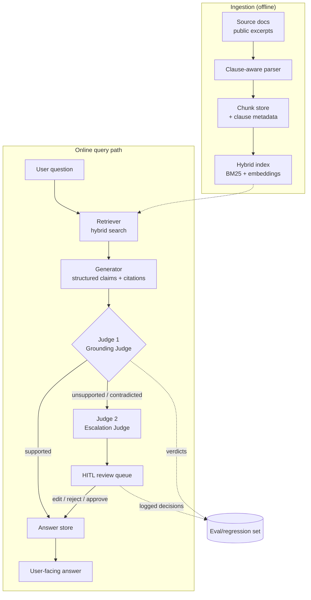

# Industrial Safety Standards Q&A — System Architecture & Roadmap

A RAG system that answers "what are the safety requirements for X" with clause-level
citations, and refuses (rather than hallucinates) when no supporting clause exists.
Every claim in an answer is machine-checked against its cited source by an LLM judge;
anything unsupported or contradicted is escalated to a second judge that packages it
for human-in-the-loop (HITL) review before it can reach the end user.

Design priority order: **correctness/refusal > citation precision > coverage > latency**.
This is a regulated-domain demo — being confidently wrong is the one failure mode that
disqualifies the whole project, so the architecture is built around catching that.

---

## 1. Scope & corpus sourcing (read this before building anything)

Full IEC/DIN/ISO standards are copyrighted and paywalled — do not scrape or ingest full
text you don't have rights to. Build the demo corpus from sources that are legitimately
public **and** retain clause numbering (a summary without clause numbers is useless here):

| Source | Why it works | Caveats |
|---|---|---|
| **OSHA 29 CFR 1910 / 1926** | Public domain, US federal register text, fully clause-numbered (e.g. §1910.147) | US-only scope, not IEC/DIN — but structurally identical problem |
| **NFPA free "read-only" access editions** (nfpa.org) | Publicly viewable, clause-numbered | View-only license — download/store only what's needed for the demo, cite back to NFPA |
| **IEC/ISO publicly published scope, terms & definitions, and ToC pages** | Legitimately free preview content on webstore listings | Only front-matter — not enough alone, use as metadata/context, not primary claims |
| **National regulator transpositions of EU harmonized standards** (e.g. machinery directive summaries) | Public, often clause-referencing | Verify each jurisdiction's license before ingest |
| **Academic/technical papers that quote clauses verbatim with citation** | Public, already citation-disciplined | Attribute to the paper *and* the standard; treat as secondary source |

**Recommendation:** anchor the corpus on OSHA 1910/1926 (unambiguously public domain,
clause-numbered, safety-relevant) and layer in whatever IEC/ISO/DIN front-matter and
legitimately-quoted excerpts you can source, clearly tagged by license tier in metadata.
Document the licensing boundary explicitly in the README so the scoping decision is
never ambiguous to a reviewer. This is a corpus-governance decision, not an engineering
detail — get it wrong and the rest of the system is moot.

---

## 2. Core design principle: answers are structured claims, not prose

The generator never returns free-text prose. It returns a list of **claims**, each one
independently checkable:

```json
{
  "query": "What are the safety requirements for lockout/tagout on machinery?",
  "claims": [
    {
      "claim_id": "c1",
      "text": "Energy-isolating devices must be locked out before servicing.",
      "citation": { "standard_id": "OSHA-1910.147", "clause": "(c)(4)(i)", "quote": "..." },
      "status": "pending_judge"
    }
  ],
  "unsupported": []
}
```

This is what makes automatic grounding-checking and clause-level citation possible at
all — you can't fact-check a paragraph, but you can fact-check `(claim, quote, clause)`
triples one at a time. `unsupported` is a **first-class field**: if the retriever finds
nothing on-point for part of the question, the generator is prompted to say so there
instead of inventing a plausible-sounding clause.

---

## 3. Architecture overview



Deliberately **not** microservices. This is one modular application (retrieval,
generation, judging, HITL are Python modules behind one API), one relational DB for
everything (documents, chunks, claims, verdicts, review decisions), one vector index.
Split it up only if a specific bottleneck demands it — for a demo of this scope, service
boundaries add operational cost with no corresponding benefit.

---

## 4. Component breakdown

### 4.1 Ingestion
- Parse source documents preserving hierarchical clause structure (e.g. `5.2.3`), not
  just page/paragraph boundaries — this is the single most important ingestion decision,
  since every downstream citation depends on it.
- Chunk **at the clause boundary** (one clause = one chunk, or a small clause + its
  immediate parent for context), never mid-clause. Store: `standard_id`, `edition/year`,
  `clause_path`, `section_title`, `license_tier`, raw `text`.
- **Canonicalize every clause identifier at ingest time.** Source documents mix
  numbering styles (`5.2.3`, `(c)(4)(i)`, `§1910.147(c)(4)`), and the generator/judges
  will echo whatever style they see. Store a normalized `citation_key`
  (`standard_id + canonical_path`) alongside the display form, and match citations
  against that key — not fuzzy string similarity — everywhere a claim's citation needs
  to be resolved back to a clause. This is what makes Judge 1's clause lookup exact
  instead of best-effort, and it's cheap to get right now vs. expensive to retrofit
  once claims/verdicts have accumulated against inconsistent keys.
- Index with hybrid retrieval: BM25 (exact term/clause-number matches matter a lot in
  this domain — "1910.147(c)(4)" is a literal string a user might type) + dense embeddings
  for semantic recall. Simple combination (reciprocal rank fusion) is enough; no need for
  a learned reranker at this scale.

### 4.2 Retriever
- Top-k hybrid retrieval over the chunk index, k tuned per query type (broader for
  "what are the requirements for X" than for a specific-clause lookup).
- Returns chunks **with full metadata attached** — the generator must never cite a
  clause it wasn't actually shown.

### 4.3 Generator (grounded, structured output)
- Prompted with: the question + only the retrieved chunks (no open-book knowledge for
  claims). Must emit the structured claims format from §2.
- Every claim must carry a verbatim `quote` from the cited chunk — this is what Judge 1
  checks against, and it also lets a human reviewer verify in one glance without
  re-reading the whole standard.
- If retrieval returned nothing relevant to part of the question, the generator is
  instructed to populate `unsupported` rather than force a citation — refusal is a
  correct, expected output, not a failure mode.

### 4.4 Judge 1 — Grounding & Contradiction Judge
For each claim, an independent LLM call (separate prompt/context from the generator —
it must not just trust the generator's framing) checks the claim's `text` against its
`quote` and against the source `clause` text directly from the corpus (not just the
generator's copy of it, to catch citation tampering/misquoting too):

- `supported` — quote entails the claim, quote is verbatim from the cited clause
- `contradicted` — the cited clause says something different from (or opposite to) the claim
- `unsupported` — cited clause exists but doesn't actually address the claim, or quote doesn't match verbatim, or no citation was given at all

Only `supported` claims pass straight through. Everything else escalates.

**Cost design, not an afterthought:** a naive implementation issues one Judge 1 call
per claim, which multiplies LLM calls linearly with answer length. Default to **one
batched Judge 1 call per answer** — all of that answer's claims passed in as a single
structured list, with an explicit instruction to evaluate each claim independently and
not let one claim's verdict bias another's (state this directly in the prompt; it's a
known LLM failure mode in batched grading). Reserve isolated per-claim calls for the
adversarial eval set in Phase 4 and for any claim a reviewer disputes, where isolating
the judge's context is worth the extra cost. Since the corpus clause text a claim cites
recurs across many queries, put it (plus the fixed judge rubric/instructions) in a
cached prompt prefix — this is the highest-leverage latency/cost lever available here,
worth more than model selection.

### 4.5 Judge 2 — Escalation Judge
Takes every non-`supported` verdict from Judge 1 and prepares a **review packet**, not a
raw dump: claim text, generator's citation (if any), actual clause text at that
location, Judge 1's stated reason, and a severity tag (`contradicted` outranks
`unsupported` outranks `no_citation`). Batches/dedupes so a human reviewer sees one
packet per claim, ranked by severity, not a firehose of raw judge logs.

### 4.6 HITL review
A reviewer works the queue and can, per claim:
- **Approve** — override Judge 1 (false positive), claim proceeds as-is
- **Edit** — correct the claim text and/or citation, then it proceeds
- **Reject** — claim is dropped from the final answer entirely

Every decision is logged with reviewer identity, timestamp, and rationale (free text).
This log **is** the audit trail a regulated-domain system needs, and it's also the raw
material for the eval/regression set below.

### 4.7 Answer assembly
Final answer to the user = all `supported` claims + all HITL-approved/edited claims,
each still carrying its citation. Claims still pending review are held back.
**Default policy: ship a partial answer immediately** with the supported claims plus an
explicit "N points pending human verification" marker, rather than blocking the whole
response on review — HITL turnaround is minutes-to-hours, not something an interactive
query should wait on. A caller can opt into blocking (`wait_for_review=true`) for
offline/batch use cases where a complete, fully-reviewed answer matters more than
latency. Never silently ship an unreviewed claim as if it were final, either way.

### 4.8 Eval / feedback loop
Judge 1 verdicts + HITL decisions accumulate into a labeled dataset (claim, citation,
verdict, human override if any). Use it to: build a growing regression suite ("these
exact claims must never again come back unsupported"), measure Judge 1's precision
against human judgment (how often did HITL overturn it?), and catch prompt-drift when
you change the generator or judge prompts.

---

## 5. Data model (sketch)

```
Standard        (id, name, edition, license_tier, source_url)
Clause          (id, standard_id, clause_path, section_title, text, parent_clause_id)
Chunk           (id, clause_id, text, embedding)              -- retrieval unit
Query           (id, text, timestamp, user_id)
Answer          (id, query_id, status)                        -- status: pending/partial/final
Claim           (id, answer_id, text, citation_clause_id, quote, status)
                                        -- status: pending_judge/supported/contradicted/
                                        --         unsupported/hitl_pending/approved/
                                        --         edited/rejected
JudgeVerdict    (id, claim_id, judge, verdict, reasoning, model_version, timestamp)
ReviewDecision  (id, claim_id, reviewer_id, action, edited_text, rationale, timestamp)
```

One Postgres (or SQLite for the demo) database covers all of this. `pgvector` (or a
local FAISS/Chroma index if staying file-based) covers the embedding side — no separate
vector-DB service needed at this scale.

---

## 6. Tech stack (kept intentionally boring)

| Layer | Choice | Why |
|---|---|---|
| API | FastAPI | async, typed, pairs well with Pydantic schemas for the claim structure |
| DB | Postgres + pgvector (SQLite+FAISS for local dev) | one store, no separate vector service |
| Retrieval | BM25 (`rank_bm25` or Postgres FTS) + embeddings, reciprocal rank fusion | simple, no learned reranker needed yet |
| Generator / Judges | Claude, via the Messages API, structured output enforced with a JSON schema (Pydantic model → tool-use/tool-call schema) | separate prompts/contexts per judge role — never reuse the generator's own reasoning trace as the judge's input |
| HITL UI | Streamlit or a small React page | queue view + approve/edit/reject actions; doesn't need to be fancy |
| Eval | A golden Q&A set + pytest-style regression harness | keep it in-repo, run in CI |

### 6.1 Model tiering (cost lever #1)

Not every role in this pipeline needs the same model capability, and paying frontier
rates for a job a smaller model does just as reliably is waste:

| Role | Task shape | Model tier |
|---|---|---|
| Generator | Synthesizes across multiple retrieved clauses, has to phrase claims precisely | Highest-capability tier available |
| Judge 1 (Grounding) | Bounded entailment check: does this quote support this claim, is the quote verbatim — closer to NLI than open-ended reasoning | Small/fast tier; batched (§4.4); escalate a specific claim to the higher tier only if the small model's own confidence is low or a reviewer disputes it |
| Judge 2 (Escalation) | Prioritizing/summarizing a handful of flagged claims into a review packet | Mid tier — needs judgment but not frontier-level reasoning |

Treat this as a starting hypothesis, not dogma — validate it against the Phase 4
adversarial eval set (§7 Phase 4) before locking it in; if the small model's
false-negative rate on contradictions is too high, move Judge 1 up a tier rather than
keep it cheap at the expense of the one guarantee this whole project rests on.

### 6.2 Cost & latency budget (cost lever #2)

Per query, expect roughly: 1 retrieval pass + 1 generation call + 1 batched Judge 1
call (cached clause-text/rubric prefix) + Judge 2 only on the escalation path (most
queries shouldn't hit it once the generator/Judge 1 prompts stabilize). Track token
counts and latency per stage from day one (§7 Phase 7 observability) — a cost
regression is as real a regression as a correctness one, and it's much easier to catch
early than to unwind after the pipeline has grown.

---

## 7. Phase-wise implementation roadmap

### Phase 0 — Scoping & corpus governance
- Finalize which standards/excerpts are in scope and their license tier (§1).
- Write the licensing boundary into the README explicitly.
- **Exit criteria:** a documented, defensible list of sources with license tier per source.

### Phase 1 — Clause-aware ingestion
- Parser(s) per source format → `Standard`/`Clause` tables, clause-path preserved.
- Chunking at clause boundaries; metadata attached.
- **Exit criteria:** every ingested clause is independently queryable by its clause number.

### Phase 2 — Retrieval
- Hybrid BM25 + embedding index; reciprocal rank fusion.
- Small labeled retrieval eval set (question → expected clause(s)); measure recall@k.
- **Exit criteria:** recall@k on the eval set meets a chosen threshold (e.g. ≥0.9 @ k=5).

### Phase 3 — Grounded generation
- Generator prompt + Pydantic schema enforcing the claims/citations/quote/unsupported structure.
- Reject/repair malformed outputs (schema validation before anything downstream sees them).
- **Exit criteria:** generator reliably emits valid structured claims, including correctly populating `unsupported` when retrieval is thin.

### Phase 4 — Judge 1 (Grounding & Contradiction)
- Independent judge prompt checking claim vs. quote vs. actual clause text (re-fetched from the corpus, not trusted from the generator).
- Verdict taxonomy: supported/contradicted/unsupported.
- Build a small adversarial eval set (deliberately wrong citations, subtly altered quotes, contradicted claims) and measure judge precision/recall on it.
- **Exit criteria:** judge catches a high fraction of injected contradictions/mismatches on the adversarial set, with a low false-flag rate on genuinely correct claims.

### Phase 5 — Judge 2 (Escalation) + HITL review
- Escalation packet construction (severity ranking, dedup).
- Review queue UI: approve/edit/reject, with rationale capture.
- Audit log (`ReviewDecision`) wired to the answer-assembly logic so only reviewed/approved claims reach the user.
- **Exit criteria:** end-to-end flow works for a flagged claim: generation → Judge 1 flag → Judge 2 packet → human decision → correct effect on the final answer.

### Phase 6 — Feedback loop & regression harness
- Turn accumulated `JudgeVerdict` + `ReviewDecision` data into a growing regression suite.
- Track judge precision against human overrides over time; alert on drift after prompt/model changes.
- **Exit criteria:** CI runs the regression suite on every change to generator/judge prompts or models.

### Phase 7 — Hardening (optional, if time allows)
- Latency/UX polish on partial-answer vs. wait-for-review tradeoff.
- Basic auth on the HITL reviewer role (this is an audit-relevant action, not anonymous).
- Observability: log every judge call's model version/prompt version alongside its verdict, so a regression is traceable to what changed.

---

## 8. Evaluation metrics to report (portfolio-relevant)

- **Retrieval recall@k** on a golden clause-lookup set.
- **Citation precision** — of claims the generator marked `supported`, what fraction actually have a verbatim, correctly-cited quote (checked against ground truth, not just Judge 1).
- **Judge 1 precision/recall** against human review on the adversarial + naturally-flagged sets.
- **Escalation rate** — fraction of claims requiring HITL review (should trend down as prompts improve, is itself a healthy metric to chart over the project's life).
- **Refusal correctness** — of questions with no supporting clause in the corpus, fraction correctly flagged `unsupported` rather than hallucinated.

These are the numbers that make the "regulated domain, grounding matters, sloppy
implementations are obviously wrong" pitch concrete rather than aspirational.
